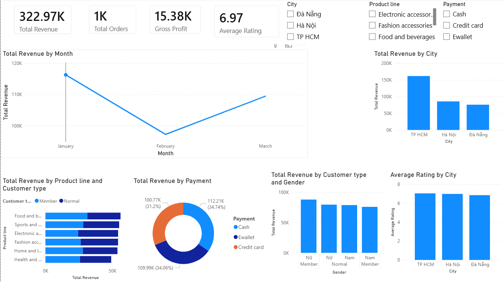

# Supermarket Sales Dashboard

## Project Overview

This Power BI dashboard analyzes supermarket sales performance across cities, customer types, payment methods, and product lines.

## Dashboard

## Business Questions Answered

- Which city generated the highest revenue?
- Which product line performs best?
- Which payment method is most popular?
- How does revenue change over time?
- How do customer types contribute to revenue?

## KPIs

- Total Revenue
- Total Orders
- Gross Profit
- Average Rating

## Tools Used

- Power BI
- DAX
- Power Query

## Dataset

Supermarket Sales Dataset